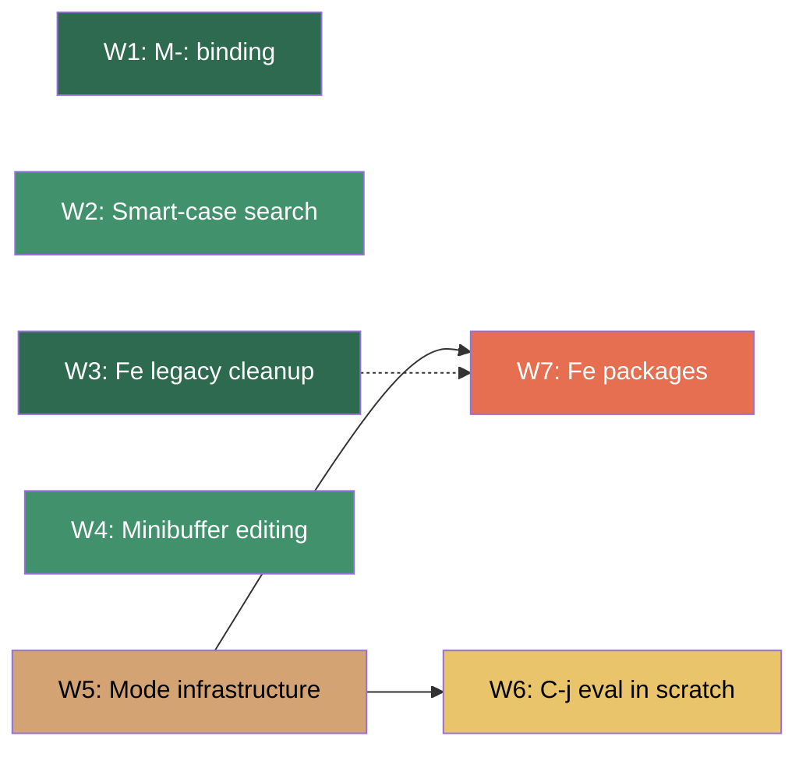

# WISHLIST Implementation Plan

> Generated from [doc/WISHLIST.md](file:///work/doc/WISHLIST.md).
> Cross-referenced against [doc/TODO.md](file:///work/doc/TODO.md) and
> the current source tree as of 2026-07-07.

## Implementation status

W1 through W6 and W7 Option B (git commit mode) are implemented and verified
by the full CI runner. W7 Option A (dired-mode) remains future work.

- W1 uses `M-:` because terminal input cannot reliably distinguish `C-:`.
- W3 required no kg-side code change: kg uses the modern Fe embedding API and
  compiles only `fe/fe.c`; removal of Fe's compatibility interfaces remains an
  upstream task.
- W5 uses focused per-buffer visual-line state and soft-wrap rendering instead
  of the proposed generic mode registry. The smaller design is covered across
  UTF-8, tabs, horizontal scrolling, and split windows.
- W6 evaluates the complete Fe form before point with a bounded lexical scan;
  `C-j` inserts the result in Lisp buffers and remains newline elsewhere.
- W7 Option B (git commit mode) rides on the existing syntax-highlight
  machinery instead of a new mode.c framework: a `SHL_GITCOMMIT` flag on a
  `HLDB` entry drives detection (`editor.syntax->flags & SHL_GITCOMMIT`),
  highlighting, and reflow policy. `C-c C-c` / `C-c C-k` are built-in
  interceptions in `kbd.c`, gated on that flag, rather than Lisp bindings —
  no `git-commit.fe` package was written, matching the "no Lisp package"
  scope cut in
  [w7b-git-commit-mode.md](file:///work/.meta-docs/plans/w7b-git-commit-mode.md).
  A new `kg_exit_status` global lets `C-c C-k` and `C-x #` report a non-zero
  or zero exit status to git without calling `exit()` directly.

---

## Overview

The wishlist contains **7 distinct items** split across two sections:

| # | Item | Section | Complexity | Dependencies |
|---|------|---------|------------|--------------|
| W1 | `C-:` eval-expression binding | Tidbits | Small | None |
| W2 | Smart-case incremental search | Tidbits | Medium | None |
| W3 | Remove legacy Fe constructs | Tidbits | Small–Medium | Fe submodule |
| W4 | Emacs-style minibuffer editing | Tidbits | Medium | None |
| W5 | Simple modes (visual-line-mode) | Tidbits | Large | Mode infra |
| W6 | `C-j` eval in `*scratch*` / lisp-mode buffers | Tidbits | Medium | W5 (partial) |
| W7 | Fe packages: dired-mode / magit-style git commit | Next steps | Large | W5, Lisp bridge |

Recommended execution order (critical-path aware):

```
W1 → W3 → W2 → W4 → W5 → W6 → W7
```

W1 and W3 are independent quickwins.  W2 and W4 are independent of each
other but both inform the search/minibuffer UX.  W5 is the gating
prerequisite for W6 and W7.

---

## W1 — `C-:` eval-expression binding

### Current state

- `eval-expression` already exists as an M-x command in
  [cmd.c](file:///work/src/cmd.c#L66-L87) (`cmd_eval_expression`).
- No `C-:` (Ctrl-colon) key code exists in the
  [KEY_ACTION enum](file:///work/src/def.h#L108-L205).
- Terminal `C-:` is **not a standard VT100 sequence** — most terminals
  do not distinguish `C-:` from `:`.  Emacs itself receives `C-:` only
  under GUI frames; in `-nw` mode it typically falls back to `M-:`.

### Decision needed

> [!IMPORTANT]
> Should `C-:` be implemented as a literal binding (terminal-dependent,
> likely unreliable), or should we bind `M-:` instead, which is the
> standard Emacs `-nw` binding and is already reliably decoded?

### Plan (assuming `M-:` as the realistic binding)

| Step | File(s) | Description |
|------|---------|-------------|
| 1 | [def.h](file:///work/src/def.h#L108-L205) | Add `ALT_COLON` to `KEY_ACTION` enum. |
| 2 | [tty.c](file:///work/src/tty.c) | In `editor_read_key`, decode ESC `:` → `ALT_COLON`. |
| 3 | [kbd.c](file:///work/src/kbd.c) | In `editor_process_keypress`, route `ALT_COLON` → `cmd_eval_expression(fd)` (call via `cmd_execute_named("eval-expression", fd)`). |
| 4 | [help.c](file:///work/src/help.c) | Add `M-:` to the help table. |
| 5 | [doc/kg.1](file:///work/doc/kg.1) | Document in man page. |
| 6 | [README.md](file:///work/README.md) | Mention in features list. |
| 7 | test/ | Add a PTY YAML case: open a buffer, press `M-:`, type `(+ 1 2)` RET, assert status line shows `3`. Requires `requires_feature: lisp`. |

**Effort**: ~1 hour.

---

## W2 — Smart-case incremental search

### Current state

- Search is implemented in [search.c](file:///work/src/search.c).
- Matching is **literal and case-sensitive** — uses raw `strstr()` in
  three places:
  - [L27](file:///work/src/search.c#L27) — `isearch_find_last_before`
  - [L66](file:///work/src/search.c#L66) — forward match in `isearch_find_match`
  - [L382](file:///work/src/search.c#L382) — query-replace match
- [doc/TODO.md L146-L147](file:///work/doc/TODO.md#L146-L147) mentions
  "Regex search, or at least a case-sensitivity toggle in isearch" as a
  TODO item.

### Desired behavior (Emacs-compatible "smart case")

1. If the search string is **all lowercase** → match case-insensitively.
2. If the search string contains **any uppercase** → match case-sensitively.
3. This applies to both `C-s` / `C-r` isearch and `M-%` query-replace.

### Plan

| Step | File(s) | Description |
|------|---------|-------------|
| 1 | search.c | Add `static int query_has_upper(const char *q, int qlen)` — scan for any uppercase byte. |
| 2 | search.c | Add `static char *case_strstr(const char *hay, const char *needle, int nlen, int fold)` — wraps `strstr` when `fold==0`, does manual caseless compare when `fold==1`. Use `tolower()` byte-by-byte (ASCII-only is fine for now; UTF-8 case-folding is a separate, larger item). |
| 3 | search.c | In `isearch_find_match`, compute `int fold = !query_has_upper(query, qlen)` once before the loop, pass to `case_strstr` in both forward and backward branches. |
| 4 | search.c | In `isearch_find_last_before`, accept a `fold` parameter, use `case_strstr`. |
| 5 | search.c | In `editor_query_replace` (the `M-%` path), apply the same smart-case rule for the search phase. Replacement text is inserted literally (Emacs does the same unless `case-replace` is on; skip that for now). |
| 6 | search.c | Update the status-line prompt to show `[case]` or `[fold]` so the user knows which mode is active. |
| 7 | test/ | PTY cases: (a) lowercase query matches mixed-case text; (b) uppercase query does not match lowercase text; (c) query-replace with smart case. |

### Edge cases

- The match highlight in `HL_MATCH` is applied via `memcpy` of `HL_MATCH`
  bytes over the rendered row's hl array.  This logic is position-based
  and doesn't need changing — as long as `case_strstr` returns the
  correct position.
- Backward search (`C-r`) uses `isearch_find_last_before`, which must
  also fold case.

**Effort**: ~3 hours.

---

## W3 — Remove legacy constructs in Fe

### Current state

- Fe is pinned at `kg-embed-1` per
  [doc/fe-upstream.md](file:///work/doc/fe-upstream.md).
- [fe/doc/c-api.md](file:///work/fe/doc/c-api.md) defines the public C
  API; "legacy constructs" refers to deprecated API symbols or old
  calling conventions that kg may still use.
- kg's Fe bridge is entirely in
  [src/lisp.c](file:///work/src/lisp.c).  It uses:
  - `FeContext`, `FeObject`, `FeRoot`
  - `FeMakeString`, `FeMakeDouble`, `FeMakeList`
  - `FeCopyStringBytes`, `FeToDouble`
  - `FeDefineNative`, `FeHandleError`, `FeRequireNoArguments`
  - `FeGetNextArgument`
  - `FeEval`, `FeCall`, `FeNil`
  - `FeCollect`, `FeRoot`/`FePushRoot`/`FePopRoot`
  - `FE_API_VERSION` (asserted == 1)

### Identified legacy constructs (from `fe/doc/c-api.md` L332-345)

The Fe API doc explicitly marks these as **legacy/process-global interfaces
slated for removal in Phase 8**:

| Legacy symbol | Modern replacement | Used by kg? |
|---|---|---|
| `FeTFex0` / `FeTFex1` / `FeTFex2` (type tags) | Phase 8 per-context custom types | ❌ No |
| Mutable `type_names` array | (pending) | ❌ No |
| Global `nil` object | `FeNil(context)` | ❌ No — kg uses `FeNil()` |
| `FeMakePtr()` | (pending) | ❌ No |
| `FeSetMarkFn()` / `FeSetGCFn()` / `FeMark()` | (pending) | ❌ No |

**kg already correctly avoids all legacy constructs.**  It uses only the
modern per-context API (`FeNil(context)`, `FeDefineNative()`,
`FeCopyStringBytes()`, `FeCreateRoot()`/`FeGetRoot()`/`FeReleaseRoot()`).
The `fex*` files that implement the legacy interfaces are excluded from
the build (Makefile compiles only `fe/fe.c`).

### Plan

| Step | Description |
|------|-------------|
| 1 | **Audit confirmation**: verify the symbol cross-reference above is still accurate against the pinned `kg-embed-1` tag. |
| 2 | Verify Makefile compiles only `fe/fe.c` and excludes `fex*.c`, `auto.*`, `main.c`. |
| 3 | **Upstream work**: submit a PR to the Fe repo removing the deprecated symbols (or gate them behind a `FE_LEGACY_API` compile flag), since kg is the primary embedder. |
| 4 | After upstream merge, bump the submodule, verify `FE_API_VERSION`, re-run CI. |
| 5 | Run `make check` with both `WITH_LISP=1` and `WITH_LISP=0`. |
| 6 | Run `.ci/ci-08-with-lisp-0.sh` to confirm the no-Lisp build still works. |

> [!NOTE]
> Since kg already avoids all legacy constructs, no **kg-side** code
> changes are needed.  The real task is upstream Fe cleanup — removing
> the deprecated symbols from `fe.h` / `fe.c` so future embedders don't
> accidentally use them.  If upstream removal is deferred, document the
> audit result and close this item.

**Effort**: ~1–3 hours (mostly audit).

---

## W4 — Emacs-style minibuffer editing (M-! and other prompts)

### Current state

- The minibuffer prompt is implemented by
  [editor_read_line](file:///work/src/bufmgr.c#L431-L470) in `bufmgr.c`.
- The current input loop handles: printable chars, Backspace/DEL,
  ESC/C-g (cancel), Enter (accept), and C-q (quoted-insert).
- **Missing**: C-f/C-b (cursor motion), C-a/C-e (line start/end),
  M-f/M-b (word motion), M-d (kill word forward), C-y (yank),
  C-k (kill to end of line), C-d (delete char forward).
- The path-reading variant
  [editor_read_line_path](file:///work/src/bufmgr.c) adds Tab-completion
  but shares the same limited editing model.

### Plan

| Step | File(s) | Description |
|------|---------|-------------|
| 1 | bufmgr.c | Add a `cursor` variable (int, 0-based position within `buf`) alongside `len`. |
| 2 | bufmgr.c | Refactor `prompt_refresh` to render a visible cursor at `cursor` rather than always at end. Update `echo_cursor_col` to `plen + cursor + 1`. |
| 3 | bufmgr.c | Handle `CTRL_F` / `ARROW_RIGHT`: advance `cursor` if `cursor < len`. |
| 4 | bufmgr.c | Handle `CTRL_B` / `ARROW_LEFT`: decrement `cursor` if `cursor > 0`. |
| 5 | bufmgr.c | Handle `CTRL_A` / `HOME_KEY`: `cursor = 0`. |
| 6 | bufmgr.c | Handle `CTRL_E` / `END_KEY`: `cursor = len`. |
| 7 | bufmgr.c | Handle `CTRL_D`: delete char at `cursor` (memmove). |
| 8 | bufmgr.c | Handle `CTRL_K`: kill from `cursor` to `len` (save to minibuffer-local kill; truncate). |
| 9 | bufmgr.c | Handle `CTRL_Y`: yank the minibuffer-local kill at `cursor` (insert + advance). |
| 10 | bufmgr.c | Handle `ALT_F` / `ALT_B`: scan word boundaries in `buf` and move `cursor`. |
| 11 | bufmgr.c | Handle `ALT_D`: kill word forward from `cursor`. |
| 12 | bufmgr.c | Handle `ALT_BACKSPACE`: kill word backward from `cursor`. |
| 13 | bufmgr.c | Insert printable chars at `cursor` instead of appending (memmove right, insert, advance). |
| 14 | bufmgr.c | Backspace deletes char before `cursor` (memmove left, decrement). |
| 15 | bufmgr.c | Apply the same changes to `editor_read_line_path`. Extract a shared `minibuf_edit_key()` helper to avoid duplication. |
| 16 | test/ | PTY cases: (a) type in M-! prompt, use C-b/C-f/C-a/C-e to navigate, verify correct command is run; (b) M-d deletes a word mid-prompt. |

### Design notes

- The minibuffer kill ring is **local** (a single static buffer in
  `bufmgr.c`), not the editor's main kill ring.  This matches Emacs
  behavior.
- Word boundaries for M-f/M-b can reuse the same `is_separator()` logic
  from [syntax.c](file:///work/src/syntax.c).

**Effort**: ~4–6 hours.

---

## W5 — Simple modes infrastructure + visual-line-mode

### Current state

- There is **no mode infrastructure**.  Buffers have a `syntax` pointer
  (for highlighting) but no concept of major/minor modes.
- The `editor_syntax` struct in
  [def.h](file:///work/src/def.h#L208-L216) has a `name` field shown in
  the mode line, but modes and syntax are conflated.
- Two synthetic syntax entries exist in `bufmgr.c`: `ibuffer_syntax` and
  `text_syntax`.
- [doc/TODO.md L98-L109](file:///work/doc/TODO.md#L98-L109) describes a
  git-commit-mode with `C-c C-c` / `C-c C-k` — that design anticipates
  per-buffer modes.
- [doc/TODO.md L193](file:///work/doc/TODO.md#L193) mentions "Add support
  for modes" as a "Maybe Later" item.

### Design

```
struct editor_mode {
    const char *name;              /* "fundamental", "visual-line", etc. */
    int flags;                     /* MODE_VISUAL_LINE, etc. */
    void (*on_enter)(void);        /* called on mode activation */
    void (*on_exit)(void);         /* called on mode deactivation */
    int (*key_override)(int, int); /* pre-dispatch hook; return 1 = handled */
    struct editor_mode *next;      /* minor-mode chain */
};
```

- **Major mode**: one per buffer, stored in `editor_config` and
  `editor_buffer`.  Replaces / augments the current `syntax` pointer.
- **Minor modes**: linked list off the major mode.  `visual-line-mode`
  is a minor mode.
- The mode line already shows `syntax->name`; extend it to show active
  minor modes too.

### Plan

| Step | File(s) | Description |
|------|---------|-------------|
| 1 | def.h | Define `struct editor_mode` with the fields above. Add `struct editor_mode *mode` to `editor_config` and `editor_buffer`. |
| 2 | def.h | Add `MODE_VISUAL_LINE` flag constant. |
| 3 | mode.c (new) | Implement `mode_set(const char *name)`, `mode_toggle_minor(const char *name)`, a small registry of built-in modes. |
| 4 | mode.c | Implement `visual-line-mode`: when active, `C-n`/`C-p` move by **visual** (wrapped) lines rather than logical lines; `C-a`/`C-e` go to visual line start/end. |
| 5 | kbd.c | Before the main dispatch switch, call `mode->key_override(c, fd)` if set. |
| 6 | display.c | In the mode-line renderer, append minor mode names after the syntax name. |
| 7 | bufmgr.c | Save/restore mode in `buf_save_to_slot`/`buf_restore_from_slot`. |
| 8 | cmd.c | Register `visual-line-mode` as an M-x toggle command. |
| 9 | help.c, doc/kg.1, README.md | Document. |
| 10 | test/ | PTY cases for visual-line-mode: wrap a long line, verify C-n moves within the visual line. |

### Visual-line-mode specifics

- `C-n`/`C-p` step by one screen row instead of one logical row.
- `C-a` goes to the first column of the current screen row (factoring in
  `coloff`), `C-e` to the last visible column.
- The visual-mark region highlighting should still work row-by-row; this
  should be transparent since the display engine already handles wrapping
  at the row level.
- This does **not** require soft-wrap rendering (which would be a much
  larger change to `display.c`).  It only changes cursor motion
  semantics within the existing truncation model.

> [!WARNING]
> Full soft-wrap (visual line wrapping in the display) is a separate,
> much larger project.  This plan covers only the **motion** aspect:
> moving by screen rows when the display is already showing the line
> extending past the right edge.  A pragmatic v1 might just toggle
> line-truncation off and move by visual segments, but this needs
> careful design to avoid display bugs.

**Effort**: ~8–12 hours.

---

## W6 — `C-j` eval in `*scratch*` / lisp-mode buffers

### Current state

- `*scratch*` is created in
  [bufmgr.c L754-L756](file:///work/src/bufmgr.c#L754-L756) when no
  files are passed on the command line.  It uses `text_syntax` (name
  "Text", no keywords) — no Lisp syntax or mode.
- `C-j` is ASCII 10 (LF).  It is **not in the `KEY_ACTION` enum** — there
  is no `CTRL_J` constant.  `ENTER` is 13 (CR), which is a separate code.
  In `editor_process_keypress`, C-j falls into the default printable-char
  handler at the bottom of the switch, but since `10 < 32`, it fails the
  `isprint` / `c >= 32` guard and is **silently ignored**.

### Desired behavior

In `*scratch*` (and eventually any `fe-lisp-mode` buffer):
1. `C-j` evaluates the **current sexp** at or before point.
2. The result is inserted on the next line, preceded by a newline.
3. Errors are shown in the status area.

### Plan

| Step | File(s) | Description |
|------|---------|-------------|
| 1 | Depends on W5 | Create `lisp-interaction-mode` as a major mode (or at minimum, set a flag on `*scratch*`). |
| 2 | mode.c / kbd.c | In the mode's `key_override`, intercept `CTRL_J` (`'\n'`, key code 10). |
| 3 | lisp.c or cmd.c | Implement `eval-last-sexp`: scan backward from point to find a balanced sexp (count parens), extract the text, call `kg_lisp_eval_string`, insert the result on the next line. |
| 4 | bufmgr.c | When creating `*scratch*`, assign `lisp-interaction-mode` as its major mode. |
| 5 | cmd.c | Register `eval-last-sexp` and `lisp-interaction-mode` as M-x commands. |
| 6 | help.c, doc/kg.1 | Document. |
| 7 | test/ | PTY case: open `*scratch*`, type `(+ 3 2)`, press C-j, assert next line contains `5`. Needs `requires_feature: lisp`. |

### Sexp extraction heuristic

A full sexp parser is overkill.  Pragmatic approach:
1. From point, scan backward for `(` counting paren depth.
2. If depth reaches 0, we found the start.  The end is point.
3. Extract substring, eval, insert result + newline.
4. If no balanced sexp is found, eval the current line.

**Effort**: ~4–6 hours (with W5 already done).

---

## W7 — Fe packages: dired-mode / magit-style git commit mode

### Current state

- No `.fe` packages ship with kg.  The infrastructure exists:
  `(kg-load "name")` resolves to `<config>/kg/lisp/name.fe`.
- Available Lisp primitives for building packages:
  - `(kg-message STR)` — show in status area
  - `(kg-insert STR)` — insert text at point
  - `(kg-buffer-name)` — return current buffer name
  - `(kg-point)` — return `(row col)` 1-based
  - `(kg-goto ROW COL)` — move cursor
  - `(kg-command NAME)` — run an allowed built-in command
  - `(kg-define-command NAME FN)` — register interactive command
  - `(kg-remove-command NAME)` — unregister
  - `(kg-bind-key SEQ CMD)` — bind `C-c <key>` to a command
  - `(kg-unbind-key SEQ)` — unbind
  - `(kg-load NAME)` — load another package
- The allowed-command list for `(kg-command ...)` is restricted to:
  capitalize-word, delete-horizontal-space, delete-trailing-space,
  downcase-word, join-line, just-one-space, transpose-chars,
  upcase-word, version, what-cursor-position.
- **Missing primitives** for a dired or git mode:
  - Buffer content reading (get line text, get region text)
  - Buffer creation / switching
  - Shell command execution from Lisp
  - File operations (delete, rename, copy)
  - Process output capture

### Option A — Dired-mode (simpler)

A read-only directory listing buffer with basic navigation.

| Step | File(s) | Description |
|------|---------|-------------|
| 1 | lisp.c | Add `(kg-line-content [ROW])` — return the text of the given or current line. |
| 2 | lisp.c | Add `(kg-buffer-line-count)` — return number of lines. |
| 3 | lisp.c | Add `(kg-shell CMD)` — run a shell command, return stdout as string. |
| 4 | lisp.c | Add `(kg-switch-buffer NAME)` — switch to or create a named buffer. |
| 5 | lisp.c | Add `(kg-set-readonly BOOL)` — set buffer read-only flag. |
| 6 | lisp.c | Add `(kg-clear-buffer)` — erase all content. |
| 7 | lisp.c | Expand the `allowed_commands` list to include `revert-buffer`, `save-buffer`. |
| 8 | share/kg/site-lisp/dired.fe (new) | Implement dired in Fe: list directory with `ls`, populate a buffer, bind `RET` to open file, `d` to mark for deletion, `x` to execute. |
| 9 | test/ | PTY case with `config_files:` installing dired.fe, open dired, navigate, open a file. |

### Option B — Git commit mode (per TODO.md)

**Implemented.** See
[w7b-git-commit-mode.md](file:///work/.meta-docs/plans/w7b-git-commit-mode.md)
for the detailed phase-by-phase plan that was executed; the steps below are
the original (pre-implementation) sketch and no longer describe the final
design in every detail (no `mode.c` framework, no `git-commit.fe` package).

Already partially designed in
[doc/TODO.md L98-L109](file:///work/doc/TODO.md#L98-L109).

| Step | File(s) | Description |
|------|---------|-------------|
| 1 | Depends on W5 | Implement git-commit-mode: auto-detected when filename matches `COMMIT_EDITMSG`, `MERGE_MSG`, `TAG_EDITMSG`, etc. |
| 2 | syntax.c | Add syntax highlighting for git commit messages: dim `#`-prefixed lines (comments), warn past col 50 on subject. |
| 3 | mode.c | `C-c C-c` → save and exit 0 (finalize commit). `C-c C-k` → exit non-zero (abort). |
| 4 | kbd.c | `C-x #` does the same as `C-c C-c` for broader EDITOR-server flow. |
| 5 | word.c | Ensure `M-q` respects col 72 in body but leaves subject alone. |
| 6 | share/kg/site-lisp/git-commit.fe (new, optional) | If the mode can be partially implemented in Lisp, package the keybindings there. |
| 7 | test/ | PTY case: open a COMMIT_EDITMSG file, verify mode activates, C-c C-c saves and exits. |

### Recommendation

> [!TIP]
> **Start with Option B** (git commit mode).  It requires fewer new Lisp
> primitives (can be mostly C-side), directly addresses the TODO.md item,
> and has higher day-to-day value for a developer-facing editor.  Dired
> requires substantially expanding the Lisp bridge first.

**Effort**: Option A ~15–20 hours; Option B ~8–12 hours.

---

## Dependency Graph



Legend: green = quick wins, amber = medium, red = large.

---

## Summary of new files

| File | Purpose |
|------|---------|
| `src/mode.c` | Mode infrastructure (W5) |
| `src/mode.h` or additions to `def.h` | Mode struct and declarations |
| `share/kg/site-lisp/dired.fe` | Dired package (W7-A) |
| `share/kg/site-lisp/git-commit.fe` | Git commit package (W7-B) |

## Summary of modified files

| File | Items |
|------|-------|
| [src/def.h](file:///work/src/def.h) | W1, W5 |
| [src/tty.c](file:///work/src/tty.c) | W1 |
| [src/kbd.c](file:///work/src/kbd.c) | W1, W4, W5, W6 |
| [src/search.c](file:///work/src/search.c) | W2 |
| [src/lisp.c](file:///work/src/lisp.c) | W3, W7 |
| [src/bufmgr.c](file:///work/src/bufmgr.c) | W4, W5, W6 |
| [src/cmd.c](file:///work/src/cmd.c) | W5, W6 |
| [src/display.c](file:///work/src/display.c) | W5 |
| [src/word.c](file:///work/src/word.c) | W7-B |
| [src/syntax.c](file:///work/src/syntax.c) | W7-B |
| [src/help.c](file:///work/src/help.c) | W1, W5, W6 |
| [doc/kg.1](file:///work/doc/kg.1) | W1, W5, W6 |
| [README.md](file:///work/README.md) | W1, W2, W5 |
| [Makefile](file:///work/Makefile) | W5 (add mode.o) |

## Estimated total effort

| Item | Hours |
|------|-------|
| W1 | 1 |
| W2 | 3 |
| W3 | 1–3 |
| W4 | 4–6 |
| W5 | 8–12 |
| W6 | 4–6 |
| W7 | 8–20 |
| **Total** | **29–50** |
